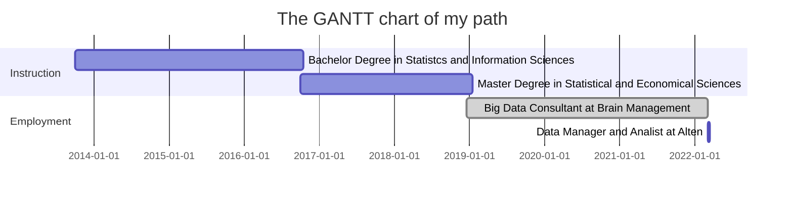

# About me

Hello, I'm Francesco, born in 1994 and since then stucked in Brianza, northern of Milan. Every time i can i run away from the city, I'm a formidable walker, I love trekking and mountain is my crush (almost as much as my girlfriend 💕), but i also like quite every kind of trails. I also practice sport climbing during the week at the jim, i find it a nice way to keep on training for the weekend journey on the mountain, to stay with my friends and a valid excuse to drink a beer toghether 🍺.
My working activities are focused on data, I studied Statistics (I gained a master degree in Statistical and Economical Sciences 🏅) and since then I work as consultant for companies focused in big data treatment. I've acquired a great familarity with data management and manipulation but I think that my principal interest is still on the meaning of data and on the information that they convey: be able to use data to extract information and knowledge is what makes data worthy of such interest from today society in data sciences. I don't know why but sometimes i see similarities between trekking and working with data, maybe for the fatigue that sometimes both activities require, maybe because as while a walk step by step the environment and your view changes i also found the same with data: you have to be always open minded and be prapared to change your opinion as you see data from different perspectives 👓.

# My Path

Need something to play with your (many) friends? You're stuck in different places or you're too bored to gather yourself somewhere to play? Or simply you want to play Lupus directly from your smartphone? Well, maybe this bot is for you!

### What do you need to play?

What you need is a bunch of friends and a smartphone with Telegram installed. Then you can start!

### Do you know the story?

_In the enchanted village of Tabula, many miles away from everywhere, every night strange, scary things happen.  
When the sun goes down, while **peasants** 🚜 sleep, some villagers turn into magic creatures:_
- ***werewolves** 🐺: that together look for an innocent victim to satisfy their hunger*.
- ***fortune teller** 🧙‍♀️: who has the power to know if a villager is good or bad*.
- ***protector** 👮‍♂️: who can protect a villager (himself included) for the night*.
_But look over there! He's not one of the previous creatures, he seems to be a normal peasant and he will if only werewolves won't try to murder him, otherwise he will become a damned werewolf too, he's a **werewolf's son** 🐾. So be careful peasants because who is now by your side, one day may be an opponent. _
_At dawn, everyone turns back to its villager state and the sun discloses the results of the night.  The debate can start: who's a damned werewolf, and who's not? All surviving villagers gather every day to discuss the problem, each villager votes one person that he thinks it's a werewolf and the villager with more votes is finally lynched.   Will werewolves take control of Tabula? Or the coalition of the honest villagers will be able to defeat them? But above all, will you survive the massacre? Will you be able to convince others to reach your goal? Let's find out!_
### How do you start the game?
1. Create a group conversation with your friends and a special guest, the lupus bot: you can find it searching for @Lupus_paccatori_bot
2. **Each participant starts a private chat with lupus bot** - don't forget this!
3. Just digit **_/start_** in your group conversation and **it's done**, you can simply follow the instructions that you'll receive!
Note: Don't worry! In case you need you can also use commands **/help**,**/rules**,**/info** in your group chat!
### List of commands
Below a brief glossary of the few commands that you will use during the game:
* **/start**: start the game. Use this command on your group conversation to start a new game.
* **/in**: join the game. Use this command on your group conversation to join the game.
* **/stop**: pause the game. Use this command on your group conversation to pause the game.
* **/_number_**: vote to kill/know/protect villager _number_. This command, depending on circumstances, is used in private or group conversation and allows to express the self-choice.
* **@w**: send messages to other werewolves. This command, used in private chat and only by werewolves, allows werewolves to communicate directly and choose their victim.
* **/help**: help command, use this command if you get confused or you don't remember what was the command syntax!
* **/info**: *Where we are at?* Use this command in the group chat to get the current status of the game.
* **/rules**: Did you forget the rules? Don't worry, type this command on the group chat and there they are! 
* **/language**: set the language (*it* or *en*, *it* is the default).
### Tips
Even if unnecessary, in case you and your friends are spread in different locations, we suggest to activate an online video chat with the other participants during the debate: this will certainly enhance your game experience!
### Authors
<table>
  <tr>
    <td align="center"><a href="https://github.com/silviasantamaria"> <b>Silvia Santamaria</b>
    <td align="center"><a href="https://github.com/frenk94"> <b>Francesco Dal Pont</b>
