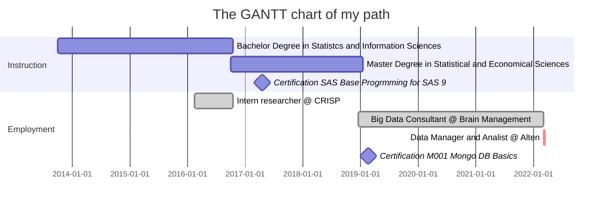

# Personal Information

Name and Surname: **Francesco Dal Pont**

Birth Date: **1994-01-21**

Country: **Italy**

📞 Phone: (+39) **3409465500**

📧 e-Mail: **dalpont.francesco94@gmail.com**

🏠 Address: **via Como 29, Lissone (MB)** 

# About me

Hello, I'm Francesco, born in 1994 and since then stucked in Brianza, northern of Milan. Every time i can i run away from the city, I'm a formidable walker, I love trekking and mountain is my crush (almost as much as my girlfriend 💕), but i also like quite every kind of trails. I also practice sport climbing during the week at the jim, i find it a nice way to keep on training for the weekend journey on the mountain, to stay with my friends and a valid excuse to drink a beer toghether 🍺.
My working activities are focused on data, I studied Statistics (I gained a master degree in Statistical and Economical Sciences 🏅) and since then I work as consultant for companies focused in big data treatment. I've acquired a great familarity with data management and manipulation but I think that my principal interest is still on the meaning of data and on the information that they convey: be able to use data to extract information and knowledge is what makes data worthy of such interest from today society in data sciences. I don't know why but sometimes i see similarities between trekking and working with data, maybe for the fatigue that sometimes both activities require, maybe because as while a walk step by step the environment and your view changes i also found the same with data: you have to be always open minded and be prapared to change your opinion as you see data from different perspectives 👓.

# My Path

    <td align="center"><a href="https://github.com/frenk94"> <b>Francesco Dal Pont</b>
